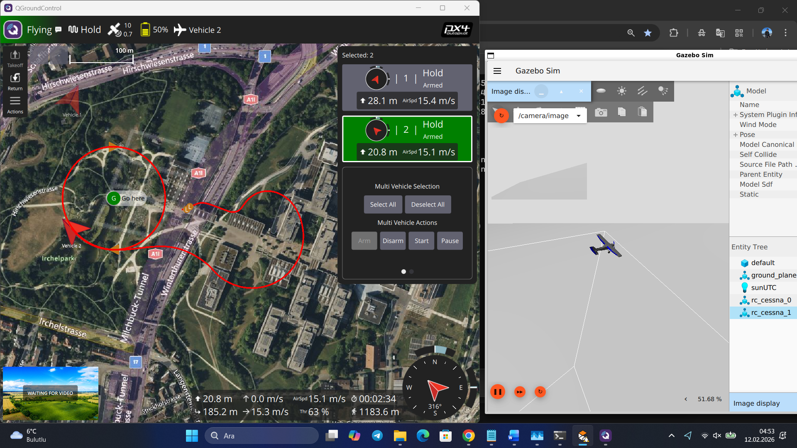
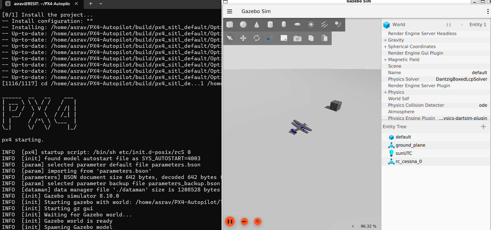
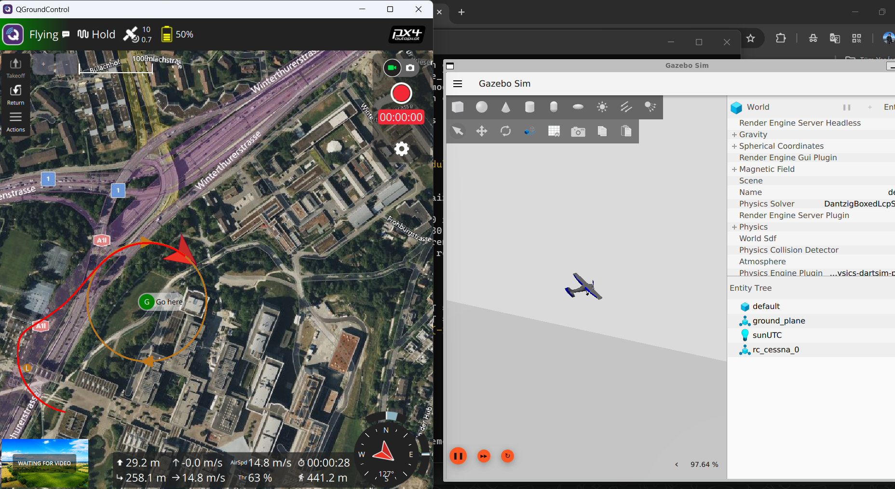
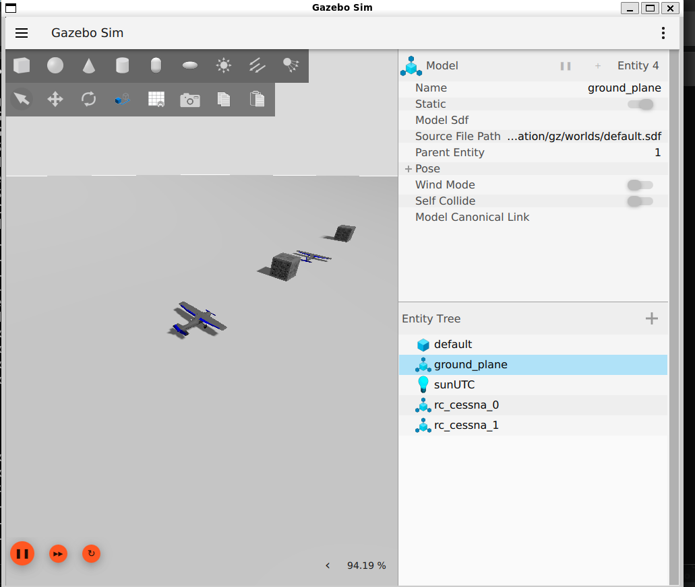
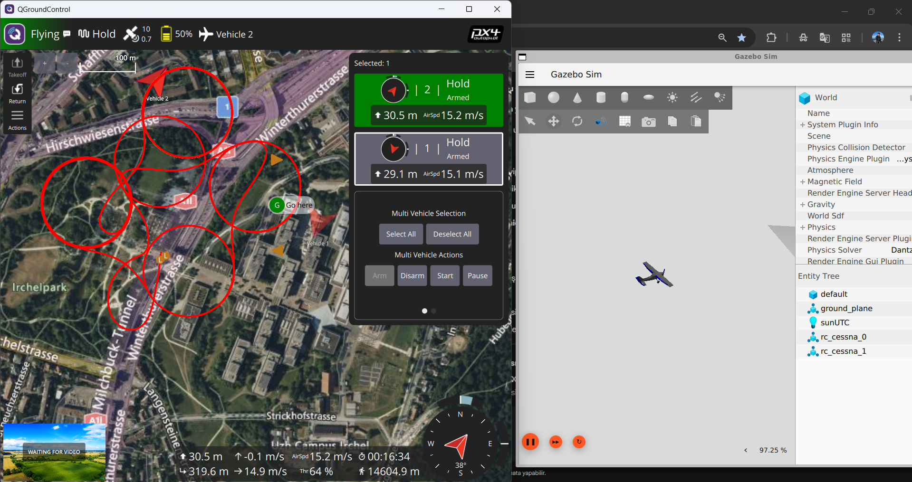

# Autonomous Flight Algorithms 🛰️


Bu proje; otonom İHA sistemleri için **PX4 Autopilot**, **Gazebo** ve **QGroundControl (QGC)** ekosistemlerinin entegrasyonu üzerine kurgulanmıştır. Geliştirilen algoritmalar, MAVLink protokolü üzerinden tam zamanlı veri alışverişi yaparak otonom görev icra etmektedir.

---

## 🛠️ Sistem Entegrasyon Mimarisi

Bir savunma sanayii projesinde sistemin nasıl haberleştiğini anlamak kritiktir. Bu projede kurduğum yapı şu şekildedir:

1.  **PX4 Autopilot (Beyin):** Uçuş kontrolcü yazılımı. Algoritmaların koşturulduğu ve uçuş kararlarının verildiği merkez.
2.  **Gazebo (Fiziksel Dünya):** İHA'nın fiziksel ağırlığı, rüzgar direnci ve sensör (Lidar, GPS, IMU) verilerinin simüle edildiği ortam.
3.  **QGroundControl (Komuta Merkezi):** MAVLink üzerinden telemetri verilerinin izlendiği, görevlerin (waypoint) harita üzerinden atandığı kullanıcı arayüzü.

> **Haberleşme Akışı:**
> `Gazebo (Sensör Verisi) -> PX4 (Algoritma İşleme) -> MAVLink -> QGroundControl (Görselleştirme/Komuta)`

---

## 📸 Sistem Ekosistemi Görünümü

<div align="center">
  
  <p><em>Şekil 1: Sol tarafta Gazebo fiziksel simülasyonu, sağ tarafta QGroundControl telemetri ekranı ve terminal üzerinde koşan PX4 SITL katmanı.</em></p>
</div>

| Otonom Görev İcrası | MAVLink Telemetri Akışı |
| :---: | :---: |
|  |  |
| *QGC üzerinden rota takibi* | *Hız, irtifa ve batarya verileri* |

---

## 📊 Simülasyon ve Sistem Testleri

Projenin Gazebo ve PX4 üzerindeki çalışma performansına dair ekran görüntüleri aşağıdadır. 

### 🛸 Multi-İHA ve Sistem Başlangıcı
<div align="center">
  
  <p><em>Şekil 1: PX4 ve Gazebo üzerinde çoklu İHA (Multi-UAV) sistem entegrasyonu ve SITL başlangıcı.</em></p>
</div>

---

### 🛠 Operasyonel Görünümler

| Sistem Başlangıcı | Kalkış Sekansı |
| :---: | :---: |
|  |  |
| *Terminal üzerinden MAVLink bağlantısı* | *Otonom kalkış ve waypoint takibi* |

| Multi-İHA Yakın Plan | Alternatif Görünüm |
| :---: | :---: |
|  |  |
| *Sürü algoritmaları test ortamı* | *Farklı kamera açılarından takip* |


---

## 🚀 Öne Çıkan Teknik Detaylar

* **SITL (Software-in-the-Loop):** Gerçek donanıma (Orange Pi / Pixhawk) ihtiyaç duymadan, kodun fiziksel dünyadaki tepkilerini %95 doğrulukla test etme imkanı.
* **MAVLink Entegrasyonu:** Düşük bant genişliğinde, yüksek güvenilirlikli veri paketleme protokolü ile yer istasyonu haberleşmesi.
* **Offboard Control:** İHA'nın kontrolünü PX4'ün standart modlarından çıkarıp, dışarıdan bir Python/C++ scripti (MAVSDK) ile devralma ve otonom rota çizme.

## 📁 Proje Klasör Yapısı

```text
.
├── src/                # Offboard kontrol scriptleri (MAVSDK/C++)
├── config/             # QGroundControl parametre dosyaları (.params)
├── worlds/             # Gazebo özel görev alanları (.world)
├── models/             # İHA ve sensör konfigürasyonları
└── docs/               # Sistem akış diyagramları
